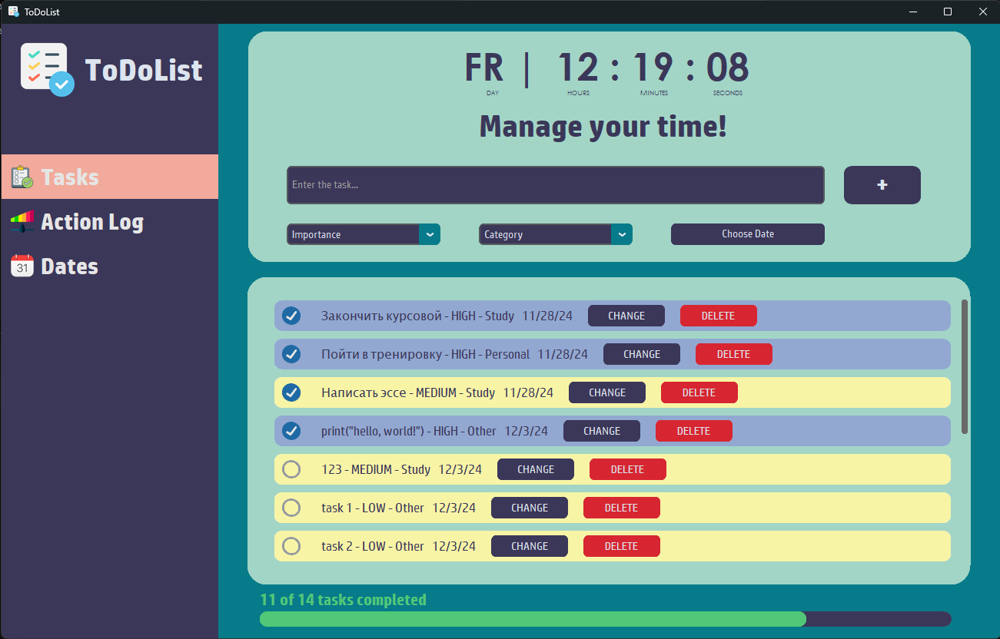

# ToDoList

## Описание проекта

To-Do List — это десктопное приложение, написанное на Python, которое позволяет пользователю управлять задачами. Приложение использует CustomTkinter для пользовательского интерфейса, tkcalendar для выбора дат и SQLite для хранения задач.

## Основные функции
- Добавление задач с указанием сроков выполнения.
- Редактирование и удаление задач.
- Отображение задач в удобном интерфейсе.
- Прогресс-трекер, позволяющий следить за выполнением задач.
- Выбор даты с помощью календаря.
- Часы и мотивационное сообщение в интерфейсе.
- Сохранение данных между сессиями (при необходимости).
   # Структура проекта
   ```plaintext
   📦 ToDoList  
   ┣ 📜 ToDoList.py    # Основной файл приложения  
   ┣ 📜 util_img.py    # Утилиты для обработки изображений  
   ┣ 📜 config.py      # Настройки приложения  
   ┣ 📜 tasks.db       # База данных SQLite для хранения задач  
   ┣ 📂 assets         # Папка с ресурсами (изображения, иконки)  
   ┗ 📜 README.md      # Документация проекта  
## Установка и запуск
### Предварительные требования
Перед началом убедитесь, что у вас установлен Python версии 3.8 или выше.
### Установка зависимостей
1. Клонируйте репозиторий:
   ```bash
   git clone https://github.com/ixyota/ToDoList
   cd ToDoList 
2. Установите необходимые зависимости
   ```bash
   pip install -r requirements.txt  
## Запуск приложения
После запуска приложения начните вводить данные задачи и нажмите кнопку "+".
Вы заметите как появилась новая задача в отдельнем фрейме.
## Скриншоты

## Настройка
### Изменение конфигурации
Файл config.py содержит настройки приложения. Вы можете изменить:
- Цветовую схему интерфейса.
## Технологии
Python 3.8
 & SQLite для хранения данных 
## Вклад в проект
Если вы хотите внести свой вклад, пожалуйста, создайте форк репозитория, выполните изменения в отдельной ветке и создайте pull request.
## Лицензия
Этот проект распространяется под лицензией MIT.
## Авторы
Если у вас есть вопросы или предложения, свяжитесь со мной:
Email: orinhanrahat@gmail.com

